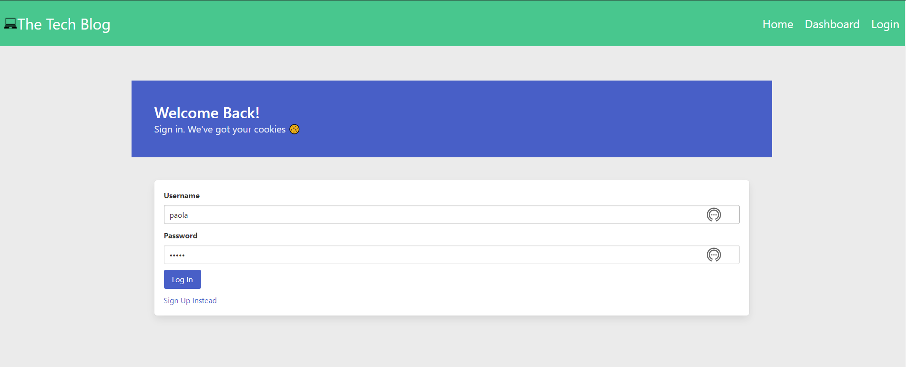
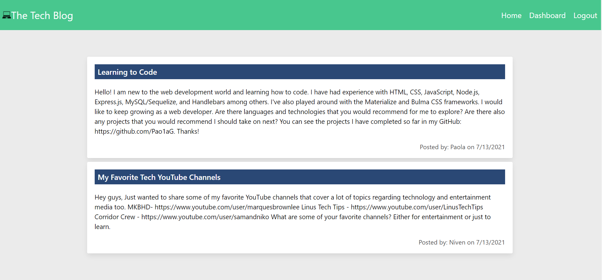
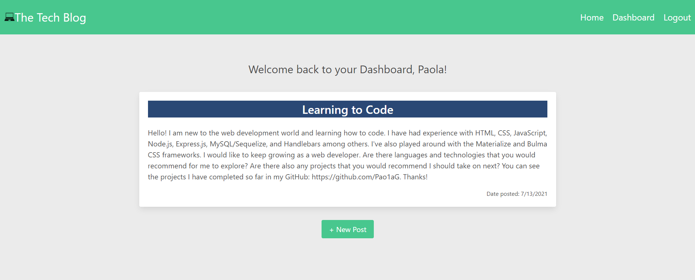
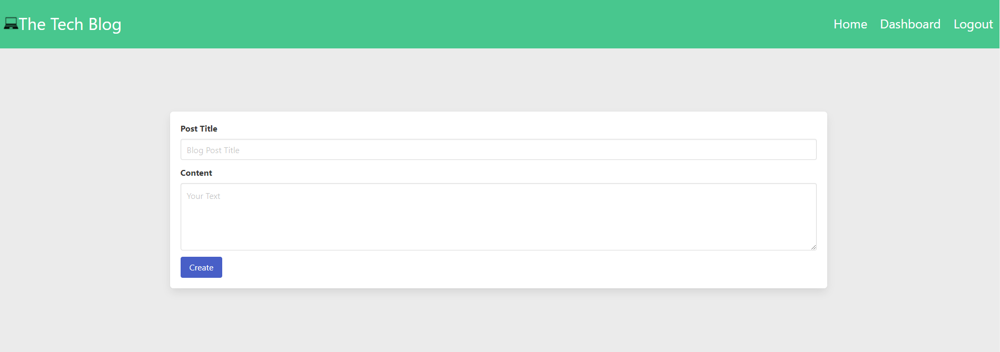

# Tech-Blog

[](https://opensource.org/licenses/MIT)

## Description

This blog site runs with Node.js, Express.js, Sequelize, and Handlebars.

A user can create an account and create new blog posts. They can access their published posts in their dashboard and can also update or delete these posts. In the homepage, a logged-in user can also comment on other user's posts.

## Table of Contents

* [License](#license)

* [Installation](#installation)

* [Usage](#usage)

* [Images](#images)

* [Credits](#credits)

* [Questions](#questions)

---

## License

This project is licensed under the MIT License. To learn more visit:   
> [MIT License](https://github.com/git/git-scm.com/blob/main/MIT-LICENSE.txt)

## Installation

To install the necessary dependencies, right-click on the root directory, open the intregrated terminal, and run this command:

```
npm i
```

If the package.json file is missing, create the file using this command:

```
npm init -y
```
To install the necessary dependencies, run this command for bcrypt, connect-session-sequelize, dotenv, express, express-handlebars, express-session, handlebars, mysql2, nodemon, and sequelize.

```
npm i <dependency>
```

## Usage

To initialize the app, right-click open the integrated terminal for the root directory. Start the mysql dependency with this command:

```
mysql -u root
```

To create the tables copy the absolute path of the schema.sql. Then type in source in the terminal and paste the path:

```
source: <file path to schema.sql>
```
Then exit MySQL by typing "exit".

If you would like to test the functionality of the blog with pre-generated users and posts, you can seed the tables with this command:

```
node seeds/seed
```

For the live application, visit [Heroku](https://floating-brushlands-26906.herokuapp.com/signup).

## Images






## Credits

MIT badge was accessed from GitHub user [Lukas Himsel](https://gist.github.com/lukas-h/2a5d00690736b4c3a7ba)

## Questions

If you have any questions, please contact me at: paolaagonzalezm@email.arizona.edu.


